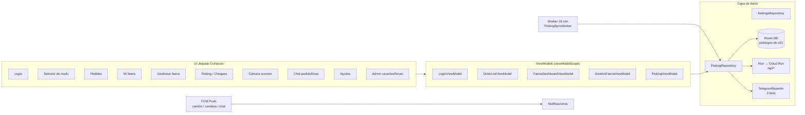
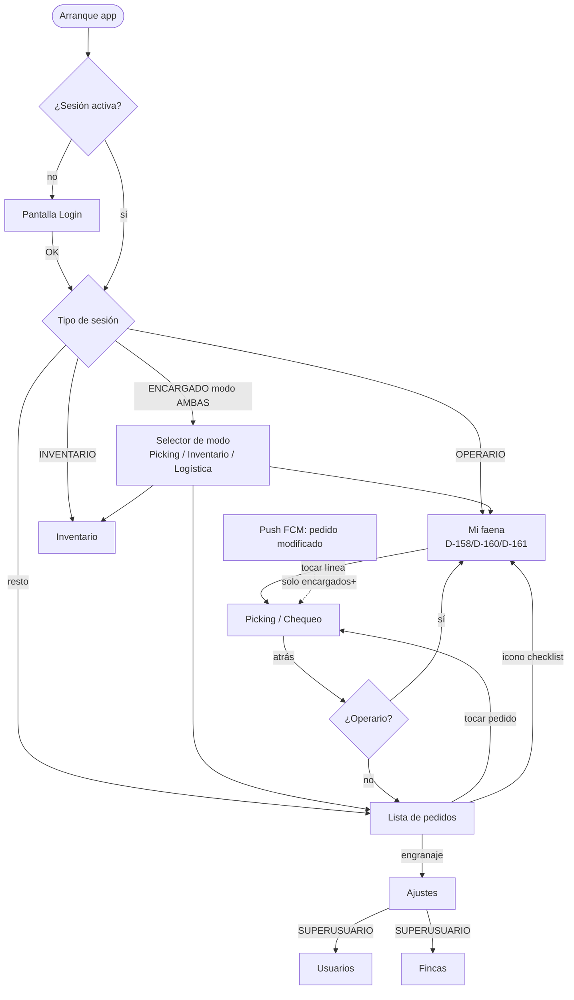
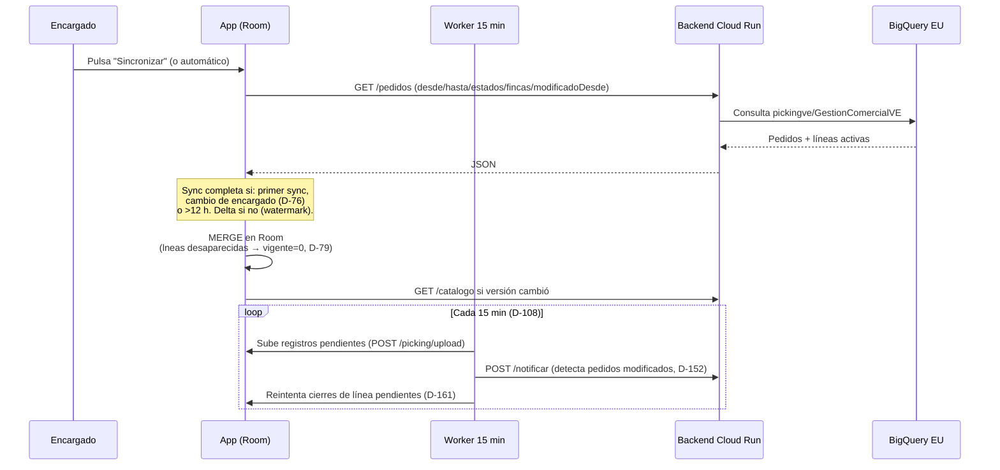
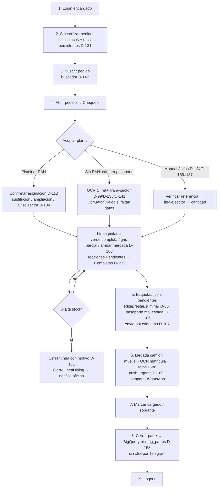
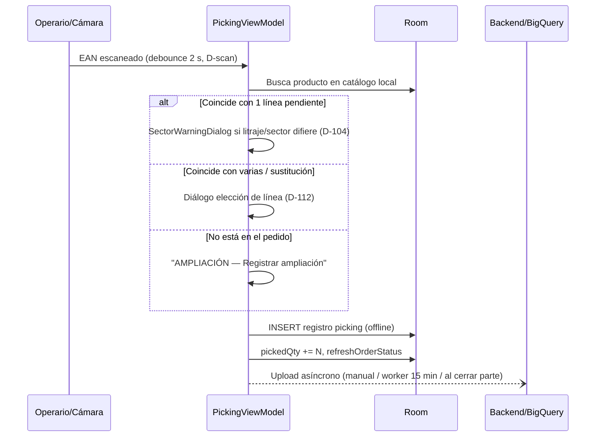
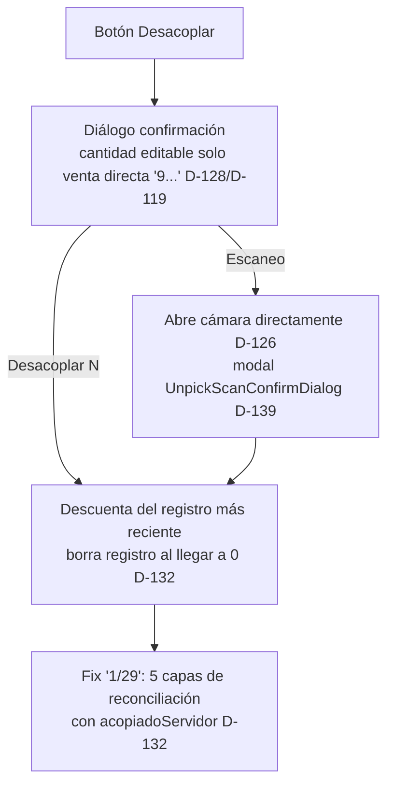
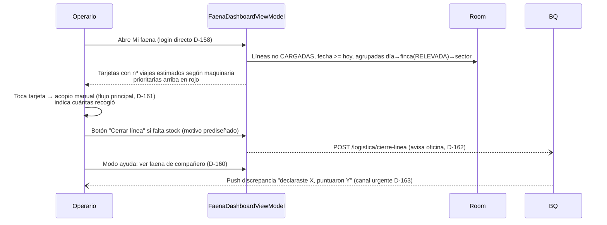
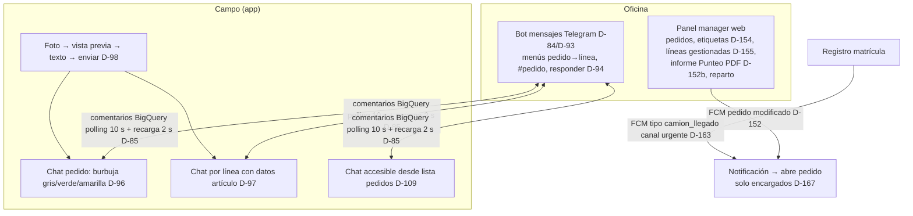

# PickingVE — Manual Visual y Trazabilidad Completa

> **Versión de la app:** 2.2.4 (versionCode 34) · **Fecha:** 2026-08-24 · **Fuente:** `docs/SPECS.md` (D-01…D-170), código en `app/src/main/java/com/vivero/pickingve/`.
>
> Este documento es el **mapa vivo** de la app: qué hace, cómo fluye pantalla a pantalla, qué decisiones la moldearon (D-XX) y qué fallos tiene hoy, cada uno con su corrección propuesta.

---

## 1. Arquitectura general (offline-first)

**Regla de oro:** la UI **solo lee Room**. La red (BigQuery vía backend Cloud Run) es asíncrona y nunca bloquea: si falla, queda pendiente y se reintenta.

---

## 2. Mapa de navegación por rol

- **Operarios (D-158/D-159/D-167):** entran directo a *Mi faena*, no ven pedidos ni partes; no navegan por push.
- **Modo ayuda (D-160):** desde Mi faena se puede ver temporalmente la faena de un compañero con banner y trazabilidad del ayudante.

---

## 3. Flujo maestro: sincronización offline-first

---

## 4. Flujo secuencial de trabajo diario (encargado)

### 4.1 Detalle: pistoleado EAN

### 4.2 Detalle: desacopio

---

## 5. Flujo secuencial operario (Mi faena)

---

## 6. Chat y notificaciones (oficina ↔ campo)

Reglas clave: sin eco propio ni a SUPERUSUARIOs (D-116), filtro de fecha (solo pedidos de hoy en adelante, D-101), lías sin pendiente ocultas (D-102).

---

## 7. Trazabilidad funcional ↔ decisiones ↔ código

| Funcionalidad | Decisión(es) | Código principal |
|---|---|---|
| Líneas visibles / orden | D-01, D-03, D-102 | `backend/main.py`, `OrderDao` |
| Badge prioridad / ELIMINADA DEL PEDIDO | D-05, D-77, D-111 | `PickingScreen.kt` |
| Sync delta/completa, cambio encargado | D-76 | `PickingRepository.syncFromApi` |
| Push pedidos modificados | D-81, D-152 | `PickingSyncWorker`, `PickingFirebaseMessagingService` |
| Chat pedido/línea + badges lectura | D-82, D-85, D-96, D-97, D-100, D-115 | `ChatDialog.kt`, `ChatEstadoDao` |
| 3 bots Telegram separados | D-84 | `TelegramReporter.kt`, `backend/main.py` |
| OCR pasaporte fitosanitario | D-99, D-114, D-138, D-141, D-143, D-145 | `ParsePlantPassportUseCase.kt`, `OcrReader.kt`, `CameraScannerScreen.kt` |
| Acopio manual 3 vías | D-105, D-113, D-118, D-124, D-129, D-135–D-137 | `PickingScreen.kt` (diálogos manuales) |
| Venta directa ("9...") prellenado | D-128 | `PickingViewModel.confirmPicking` |
| Desacopio con confirmación + fix 1/29 | D-119, D-122, D-126, D-132, D-139 | `PickingScreen.kt`, `PickingRepository` |
| Cámara a pantalla completa + anti-OOM | D-125, D-130 | `CameraScannerScreen.kt` (decodeSampled) |
| Cierre de línea con motivo | D-161, D-162 | `CierreLineaDialog.kt`, `OrderDao.setLineCierre` |
| Llegada camión (muelle, OCR matrículas, fotos) | D-88, D-163 | `PickingScreen.kt`, `PickingApiClient.guardarMatricula` |
| Mi faena + reparto + ayuda | D-158, D-159, D-160 | `FaenaDashboardScreen/ViewModel`, `GestionFaena*` |
| Alerta citrícos inmovilizados | D-148 (pendiente conector) | — |
| Informe Punteo PDF GlobalGAP | D-152b enmendado | `backend/punteo_pdf.py` |
| Panel manager (etiquetas, gestionadas, enviados) | D-154, D-155, D-157 | `backend/web/manager` |
| Limpieza datos locales | D-110, D-121 | `SettingsViewModel.limpiarDatosLocales` |
| Seguridad sesión/secrets | — | `EncryptedSharedPreferences`, `BuildConfig` desde `secrets.properties` |

Versiones publicadas: 1.7.3 → 1.7.12 (D-123, D-127, D-140, D-142, D-144, D-146, D-149, D-151, D-153) → 2.1.0/2.1.1 (D-165, D-167) → **2.2.2 actual**.

---

## 8. Auditoría técnica (2026-08-24)

> **Estado tras v2.2.4 (D-168/D-169/D-170):** ✅ lint 0 errores, ✅ tests 16/16, ✅ build OK. Los hallazgos 🔴R1 y 🟡Y1a/Y1b/Y4-Y9 quedaron corregidos; R2 (API_KEY) aceptado como riesgo documentado; Fase 5 (upgrade de dependencias) aplazada por decisión del usuario.

Compilación original al auditar: ✅ `assembleDebug` OK · Tests: ✅ · Lint original: ❌ 1 error, 73 warnings. Hallazgos y resolución:

### 🔴 Errores críticos / bloqueantes

| # | Hallazgo | Ubicación | Estado |
|---|---|---|---|
| R1 | Uso de API experimental CameraX sin opt-in → `lintDebug` abortaba | `CameraScannerScreen.kt` + nuevo call site en `PickingScreen.kt` (v2.2.3) | ✅ Corregido en v2.2.4 vía `app/lint.xml` (opt-in de proyecto; anotar composables propagaba el requisito hasta MainActivity) |
| R2 | Secreto compartido embebido en APK (`API_KEY` en BuildConfig) | `app/build.gradle.kts`, `Constants.kt` | ⚠️ Aceptado por diseño (D-170); mitigación futura: rotación periódica. Backend sin tocar |

### 🟡 Advertencias y deuda técnica

| # | Hallazgo | Estado |
|---|---|---|
| Y1a/b Scopes sueltos (`runOcr`, servicio FCM) | ✅ Corregidos en v2.2.4 |
| Y2 targetSdk 34 | Pendiente (requiere prueba en tableta) |
| Y3 Dependencias antiguas | Aplazado por decisión del usuario (no alterar entorno del agente paralelo) |
| Y4 dataExtractionRules + portrait | ✅ Corregido en v2.2.4 (portrait intencional, tools:ignore documentado) |
| Y5 Checks SDK obsoletos + recursos sin usar | ✅ Corregido en v2.2.4 |
| Y6 mutableIntStateOf ×3 | ✅ Corregido en v2.2.4 |
| Y7 key en CierreLineaDialog | ✅ Corregido en v2.2.4 |
| Y8 orden de modifier | ✅ Corregido en v2.2.4 |
| Y9 deps fuera del TOML | ✅ Movidas al catálogo (sin subir versiones) en v2.2.4 |
| Y10 Release sin R8 | No aplica (se distribuyen APKs debug) |
| Y11 Cobertura de tests | ✅ +8 tests del parser de pasaporte (D-138/D-141/D-145) |

### 🟢 Puntos fuertes y estado general

- **Offline-first bien implementado:** la UI solo lee Room; DAOs 100% `suspend`/`Flow` (Room gestiona su hilo); red con Ktor CIO en sus propios hilos; OCR decodifica en `Dispatchers.Default` con `inSampleSize` (fix OOM D-130).
- **Ciclo de vida correcto:** todos los estados usan `collectAsStateWithLifecycle()` (9 pantallas); executor de cámara liberado en `onDispose` (`CameraScannerScreen.kt:72-76`); Flows expuestos con `stateIn(viewModelScope, WhileSubscribed(5000))`.
- **Seguridad razonable:** sesión y settings en `EncryptedSharedPreferences` (AES256-SIV/GCM) con fallback controlado (`SettingsRepository.kt:36-44`, `PickingRepository.kt:77-85`); secretos fuera del código (`secrets.properties` gitignored → BuildConfig); manifest limpio: sin cleartext, `FileProvider` y servicio FCM no exportados, permisos mínimos.
- **Manejo de errores robusto:** ~65 puntos try/catch/runCatching; helper central `launchCatching` en `PickingViewModel` ("nunca crashea"); errores de red convertidos en mensaje de UI.
- **Listas eficientes:** todas las listas grandes llevan `key = { ... }` estable.
- **Estado (v2.2.4):** app compilando, tests 16/16 verdes, lint 0 errores, 170 decisiones documentadas en SPECS.md. Sin bloqueantes.

### 📋 Plan de acción — ejecutado y pendiente

Ejecutado en v2.2.4 (D-168/D-169/D-170): R1 vía `app/lint.xml`, Y1a/b scopes estructurados, Y4 dataExtractionRules + tools:ignore portrait, Y5 recursos/checks obsoletos, Y6/Y7/Y8 limpieza lint, Y9 deps al TOML, Y11 tests del parser de pasaporte. R2 aceptado como riesgo documentado con rotación futura.

Pendiente (requiere ventana propia):
1. **Y2:** subir targetSdk a 35 probando en tableta real.
2. **Y3:** upgrades de dependencias por bloques (Room → 2.8.x validando migraciones; security-crypto → estable; Compose BOM nuevo exige migración Kotlin 2.x).
3. **Rotación de API_KEY** en el próximo mantenimiento (mitigación acordada para R2).

---

## 9. Fallos conocidos históricos y cómo se resolvieron (lecciones)

| Síntoma en campo | Causa raíz | Fix aplicado | Ref |
|---|---|---|---|
| Caída al capturar etiqueta sin EAN (12 MP) | Bitmap completo en memoria | Captura a archivo + `inSampleSize` ≤1600 px | D-130 |
| "1/29" imposible de desacopiar | Registro borrado localmente aún no subido; snapshot remoto decía 1 | Reconciliación en 5 capas con `acopiadoServidor` | D-132 |
| Chat de pedido siempre vacío | `chatLinea = ""` vs `null` en filtro backend | Normalización `"" → null` | D-115 |
| Pedidos no bajaban al cambiar encargado | Watermark global de sync delta | Flag `last_sync_encargado` → sync completa | D-76 |
| OCR "no encontrado en el catálogo" | Comparación exacta con guiones/espacios; litraje-palabra no detectado | `normalizarRef`, parser geométrico por altura de fuente | D-138, D-141 |
| "Varios productos coinciden con C:" tras elegir litraje | Resolución ignoraba la elección del usuario | Fix de resolución en flujo OCR | D-145 |
| Filtro de días se reseteaba a hoy | Sin persistencia | Preferencias serializadas ISO | D-131 |
| Eco de notificaciones al autor/SUPERUSUARIOs | Difusión sin exclusiones | Excluir autor (app) y SUPERUSUARIOs (TG) | D-116 |
| Desplegable sin los 6 litrajes de la referencia | Buscador pre-filtraba por valor elegido | Dropdown simple con TODAS las variantes | D-136 |

---

*Cualquier cambio de comportamiento nuevo debe registrarse como nueva decisión D-XX en `docs/SPECS.md` antes de implementarse.*
